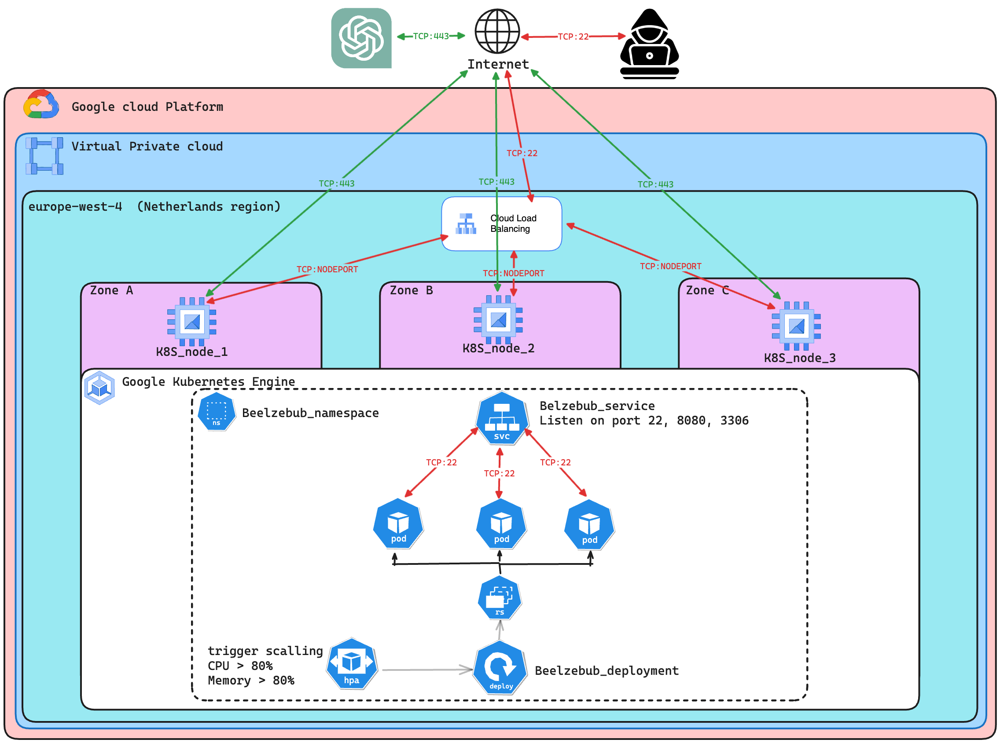

# belz_gke


### Architecture Diagram
<br>




> :warning: **Disclamer**
The helm-chart used in this project is the entire responsibility of the Beelzebub projec  **[Beelzebub project](https://github.com/mariocandela/beelzebub)**  owner. Please check his github page for further details and check the framework available functionalities. Moreover, the helm-chart it was copied into this repository to ease here to ease the chart deployment.


### prerequesits
* enable compute engine api https://console.cloud.google.com/apis/library/compute.googleapis.com
* enable kubernetes engine api https://console.cloud.google.com/apis/library/container.googleapis.com
### clone beelzebub repo 

### clone belz_gke repo 
```bash
git clone https://github.com/JMendes1995/belz_gke.git
```

### enter in belz_gke dir
```bash
cd belz_gke/terraform
```

### build tfstate bucket
```bash
cd tf_state_bucket
terraform apply -var-file=../env.tfvars
```

### execute terraform modules
```bash
cd ..
./executor.sh base apply
./executor.sh belz_k8s apply
```

### Install using "apt-get install" for DEB based systems
```bash
sudo apt-get install google-cloud-sdk-gke-gcloud-auth-plugin
```

### Install using "yum install" for RPM based systems
```bash
sudo yum install google-cloud-sdk-gke-gcloud-auth-plugin
```

### Verify installation
```bash
gke-gcloud-auth-plugin --version 
```

### install gke-gcloud-auth-plugin
```bash
gcloud components install gke-gcloud-auth-plugin
```

### install kubectl 
```bash
gcloud components install kubectl
```

### Authenticate into GKE cluster
```bash
gcloud container clusters get-credentials belz-gke --region europe-west4 --project belz-406915
```

### Check kubernetes context
```bash
kubectl config get-contexts
```

### deploy beelzebub helm chart

```bash
helm install -f ../beelzebub-chart/values.yaml beelzebub ../beelzebub-chart
```

### check running pods
```bash
kubectl get pods -n beelzebub
```

### check network loadbalancer ip
```bash
kubectl get services -n beelzebub
```

### ssh using the loadbalancer public ip 
```bash
ssh -o StrictHostKeyChecking=no -o UserKnownHostsFile=/dev/null root@NLB_PUB_IP
```

#### Enjoy the hack
